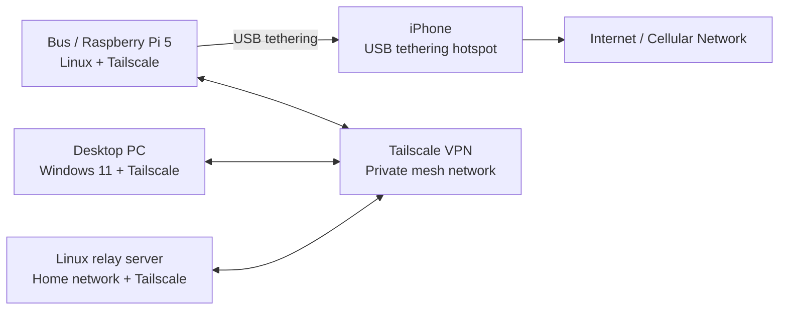

# Autonomous Vehicle
## Goal : Turn a Tamiya King Yellow 6x6 into a fully autonomous vehicle
The King Yellow is a six wheel drive RC kit from Tamiya. I'll skip all the nostalgia about Tamiya RC models, but those who have built any of these kits know the enjoyment of putting together a simple [...]

Here's a picture from Tamiya (Stock Photo)

We're going to take one of these trucks (bus) and convert it into a fully autonomous vehicle. But before we beging, let's take a look at what we have to work with. A few things to note about this bus
* It's pretty much stock
* We did install a camera from a quadcopter/drone. This is totally seperate from the stock electronics and using it's own lithium battery as a power supply. This was done so we could run it normally ([...]
* There's a gopro mount on top. I honestly forget what we did with that, but presumably we mounted a gopro on it to record stuff.

## Plan 
### Phase 1 - Hardware augmentation
First is to outfit the bus with some new hardware. For this I went back and forth between an Arduino UnoQ and a Raspberry Pi. I'm going with rpi for a few reasons. We're going to need a decent MPU for[...] 
#### Parts List
1. https://learn.adafruit.com/16-channel-pwm-servo-driver
1. https://www.raspberrypi.com/products/raspberry-pi-5
1. https://www.raspberrypi.com/products/camera-module-3
2. 5200 mAh Anker USB Power Bank.
I'm not sure how long that powerbank will last, but I have a USB power meter that I'll use later on to figure  out how long pi will run before it shuts off due to lack of power. Certainly something to[...] 
#### Functional Requirements
* Bus can boot linux and I can control some servos with software on Linux.
* Ethernet can be attached for network
* Servo driver connected to rpi.
* Servos do not have to be bus servos. Bus has electronic speed control.

### Phase 3 - Network connectivity
Get connectivity between bus and home LAN. This will allow me to monitor the bus, take over manually, and stream video back.
#### Functional Requirements
* Desktop PC (windows 11) connected to the bus over WAN (internet)
* Linux LAN PC connect to bus over WAN (ssh, mqtt).
* Can stream video from pi cam to windows 11 pc over WAN
#### iPhone Tether
The plan is to tether my iPhone to the rpi over USB and enable hotspot on the phone. It's slightly awkward that you enable hotspot to get connectivity over USB, but that's apparently how the iPhone works.
#### VPN
Once the bus has internet connectivity, we'll connect everything on one network via a VPN. I'm going to use tailscale for this. It was the first zero cost VPN that I found and it's super easy to setup.

#### Network Topology

The bus uses a Raspberry Pi 5 running Linux as its onboard computer. For internet access, the Pi is tethered to an iPhone over USB. Once the Pi has upstream connectivity, it joins a Tailscale VPN along with:

* a Windows 11 desktop PC
* a Linux relay server on the home network

This setup gives the bus a secure private network connection back to the systems I use for monitoring, control, SSH access, and video streaming.

#### Intended Use

This network layout is meant to support a few different tasks:

* **Remote shell access** to the Raspberry Pi over SSH
* **Telemetry and messaging** between the bus and other systems, likely over MQTT
* **Manual intervention or monitoring** from the Windows desktop
* **Video streaming** from the Pi camera back to a workstation
* **Relay or bridge services** hosted from the Linux machine on the home network

Using Tailscale means each machine can communicate over a private VPN without needing to expose services directly to the public internet.

### Pahse 4 - OpenCV Vision Integration
#### Functional Requirements
* Bus can navigate itself around block without manual steering
