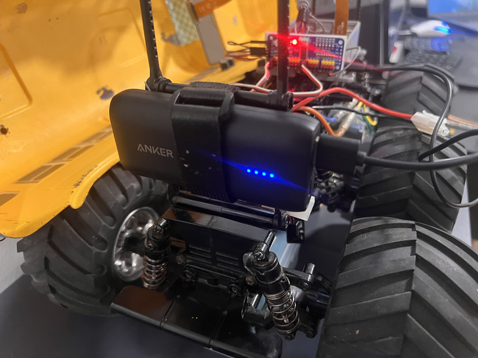
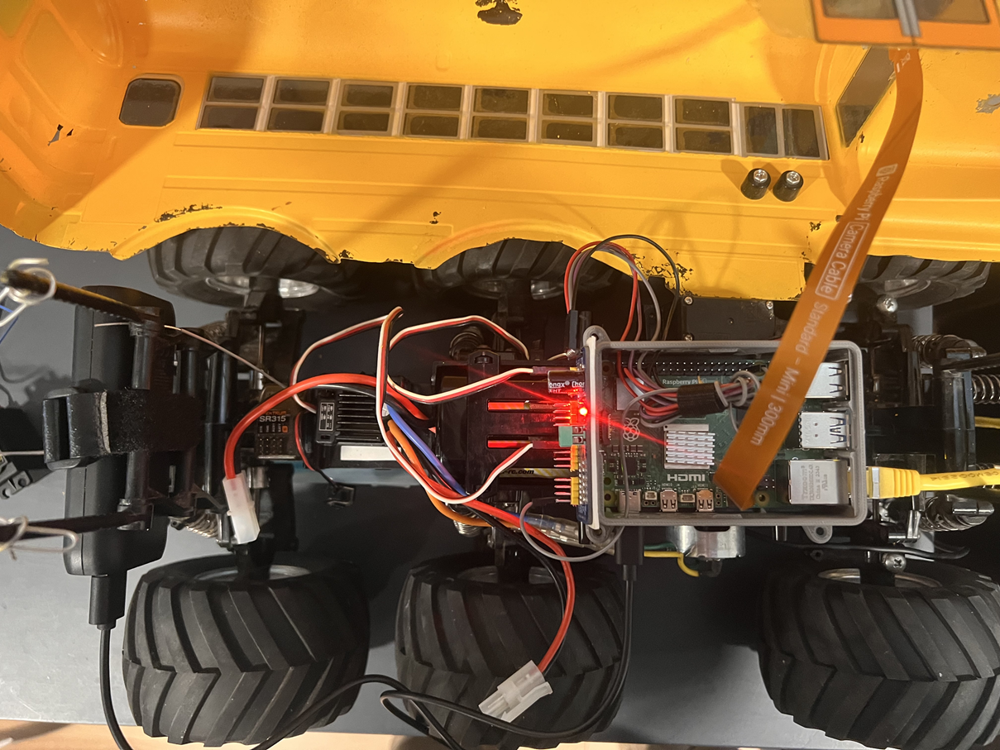
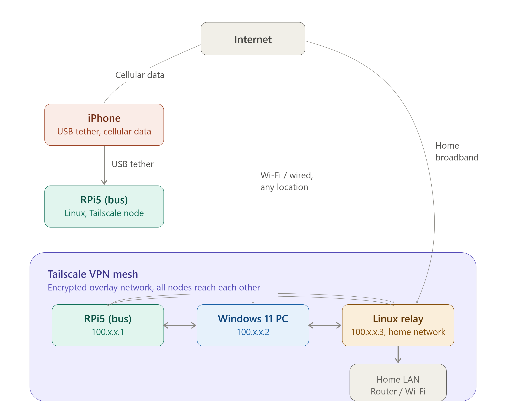

# Autonomous Vehicle

## Goal: Turn a Tamiya King Yellow 6x6 into a fully autonomous vehicle

The King Yellow is a six-wheel-drive RC kit from Tamiya. I’ll skip the nostalgia, but having built a few of these kits, I can say they’re always fun to put together.

Here’s a stock photo from Tamiya:

I’m going to take one of these buses and convert it into a fully autonomous vehicle. Before I begin, here’s what I’m starting with:

- It’s mostly stock.
- I installed a camera from a quadcopter/drone. This is completely separate from the stock electronics and uses its own lithium battery, so I can still run the bus normally without depending on the new system.
- There’s a GoPro mount on top. I honestly forgot what I used it for, but I probably mounted a GoPro to record runs.

## Plan

### Phase 1 - Hardware Augmentation

The first step is to outfit the bus with new hardware. I went back and forth between an Arduino UNO-Q and a Raspberry Pi, but I’m going with a Raspberry Pi for a few reasons.
1. I wasn't sure if the UnoQ's arm core was powerful enougth to run things like OpenCV
1. I already own an rpi5
1. I'm anxiously waiting for Arduino VENTUNO-Q.
I concede that using a newer dual MCP/MPU arduino would be a cleaner setup since the pi needs an external board to drive servos properly. And although the UNO-Q needs the Arduino Media Carrier board to attach a MIPI CSI camear, it would be a cleaner package.

#### Parts List

1. https://learn.adafruit.com/16-channel-pwm-servo-driver
2. https://www.raspberrypi.com/products/raspberry-pi-5
3. https://www.raspberrypi.com/products/camera-module-3
4. 5200 mAh Anker USB power bank
   
#### Functional Requirements

- The bus can boot Linux, and I can control servos from software running on Linux.
- I can attach Ethernet for networking.
- The servo driver is connected to the Raspberry Pi.
- The servos do not need to be specialized bus servos. The bus already has an electronic speed controller.
- 
I’m not sure how long that power bank will last, but I have a USB power meter I can use to measure runtime before the Pi shuts down from low power.

Here’s the Raspberry Pi 5 booted from the Anker power bank:

The Adafruit PCA9685 servo driver is connected and working. The driver itself is connected to the Raspberry Pi over I2C and powered from one of the Pi’s 3.3V pins. The servos are powered separately as required.

### Phase 3 - Network Connectivity

I want connectivity between the bus and my home LAN. This will let me monitor the bus, take over manually, and stream video back.

#### Functional Requirements

- My desktop PC (Windows 11) can connect to the bus over WAN (internet).
- My Linux LAN PC can connect to the bus over WAN (SSH, MQTT).
- I can stream video from the Pi camera to my Windows 11 PC over WAN.

#### iPhone Tether

The plan is to tether my iPhone to the Raspberry Pi over USB and enable hotspot on the phone. It’s a little awkward that hotspot must be enabled to get USB tethering, but that appears to be how iPhone tethering works.

#### VPN

Once the bus has internet connectivity, I’ll put everything on one network using a VPN. I’m using Tailscale because it was the first zero-cost option I found, and it’s easy to set up.

#### Network Topology

- My Raspberry Pi 5 (on the bus) gets internet via USB tethering to my iPhone, which uses cellular data.
- Once online, the Raspberry Pi joins my Tailscale mesh as a node.
- My Windows 11 desktop and a Linux relay server (on my home network) are also Tailscale nodes in the same mesh.
- Tailscale builds direct encrypted tunnels between peers when possible, and the relay server—on my home LAN with stable connectivity—can act as a fallback relay/exit node for the bus when needed.

#### Intended Use

This network layout is meant to support a few different tasks:

- **Remote shell access** to the Raspberry Pi over SSH
- **Telemetry and messaging** between the bus and other systems, likely over MQTT
- **Manual intervention and monitoring** from my Windows desktop
- **Video streaming** from the Pi camera back to my workstation
- **Relay or bridge services** hosted on the Linux machine on my home network

Using Tailscale means each machine can communicate over a private VPN without exposing services directly to the public internet.

### Phase 4 - OpenCV Vision Integration

#### Functional Requirements

- The bus can navigate itself around the block without manual steering
