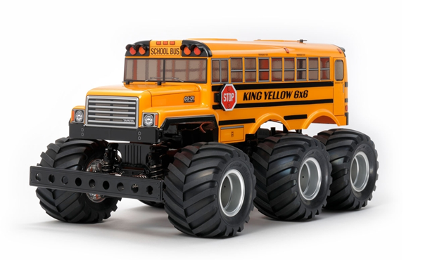
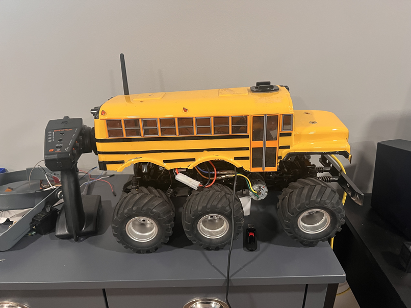

# Autonomous Vehicle
## Goal : Turn a Tamiya King Yellow 6x6 into a fully autonomous vehicle
The King Yellow is a six wheel drive RC kit from Tamiya. I'll skip all the nostalgia about Tamiya RC models, but those who have built any of these kits know the enjoyment of putting together a simple gearbox, hooking up the electronics, and having endless hours of fun trashing it. They're pretty much indesctructable. 

Here's a picture from Tamiya (Stock Photo)

We're going to take one of these trucks (bus) and convert it into a fully autonomous vehicle. But before we beging, let's take a look at what we have to work with. A few things to note about this bus
* It's pretty much stock
* We did install a camera from a quadcopter/drone. This is totally seperate from the stock electronics and using it's own lithium battery as a power supply. This was done so we could run it normally (radio controlled) from the back of our house and drive it around the front while watching the video from a fatshark headset.
* There's a gopro mount on top. I honestly forget what we did with that, but presumably we mounted a gopro on it to record stuff.

